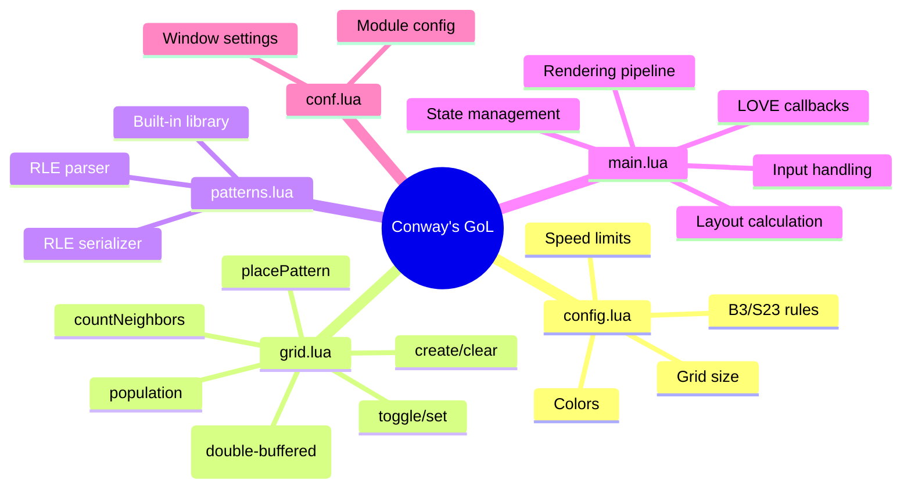

# Conway's Game of Life -- Design Spec

## Context

Build a fully-featured Conway's Game of Life simulator in Lua + LOVE2D. The goal is a visually polished, responsive simulation with electric green on black aesthetics, full keyboard/mouse/touch controls, a pattern library, RLE import/export, and web deployment via love.js. Responsive layout supports mobile, iPad, and desktop viewports.

## Architecture



## File Structure

```
conways-game-of-life/
  conf.lua        -- LOVE2D engine configuration
  config.lua      -- Constants (colors, grid size, rules, speed)
  grid.lua        -- Pure simulation core (zero mutable state)
  patterns.lua    -- Pattern library + RLE parser/serializer
  main.lua        -- LOVE callbacks, state, rendering, input
```

## Data Structures

### Grid (flat array)

Single Lua table of `GRID_WIDTH * GRID_HEIGHT` integers (0 or 1). Index: `y * width + x + 1` (1-based for Lua). Two pre-allocated buffers for double-buffered ping-pong -- zero allocations per generation.

### Game State (in main.lua only)

```lua
state = {
    cells, bufA, bufB,           -- grid data (double-buffered)
    paused, generation, speed,   -- simulation control
    accumulator,                 -- fixed timestep accumulator
    layout = {                   -- recalculated on resize
        cellSize, offsetX, offsetY,
        gridPixelW, gridPixelH, hudHeight
    },
    gridCanvas, needsGridRedraw  -- cached grid line canvas
}
```

### Pattern

```lua
{ name = "Glider", width = 3, height = 3, cells = {{1,0},{2,1},{0,2},{1,2},{2,2}} }
```

Offsets are relative to (0,0) origin, translated on placement.

## Modules

### config.lua

Returns a plain table of constants:

| Constant | Value | Purpose |
|---|---|---|
| `GRID_WIDTH/HEIGHT` | 100 | Logical grid dimensions |
| `COLOR_ALIVE` | `{0, 1, 0, 1}` (#00ff00) | Electric green |
| `COLOR_DEAD` | `{0.04, 0.04, 0.04, 1}` (#0a0a0a) | Near black |
| `COLOR_GRID` | `{0.1, 0.1, 0.1, 1}` (#1a1a1a) | Subtle grid lines |
| `COLOR_HUD_BG` | `{0, 0, 0, 0.7}` | Semi-transparent HUD bar |
| `COLOR_HUD_TEXT` | `{0, 1, 0, 1}` | Green HUD text |
| `DEFAULT_SPEED` | 10 | Generations per second |
| `MIN_SPEED / MAX_SPEED` | 1 / 60 | Speed range |
| `RANDOM_DENSITY` | 0.20 | 20% alive on random seed |
| `BIRTH` | `{[3] = true}` | B3 rule as lookup table |
| `SURVIVAL` | `{[2] = true, [3] = true}` | S23 rule as lookup table |

### grid.lua -- Pure Simulation Core

All functions are pure: data in, new data out. No globals, no module-level state.

**Key functions:**

- `grid.create(width, height)` -- Returns flat array of zeros
- `grid.index(x, y, width)` -- (x,y) to 1-based flat index
- `grid.get(cells, x, y, w, h)` -- Get cell with toroidal wrapping (`x % width`, Lua `%` is non-negative for positive divisor)
- `grid.set(cells, x, y, w, h, value)` -- Return new grid with cell set
- `grid.toggle(cells, x, y, w, h)` -- Return new grid with cell toggled
- `grid.step(cells, w, h, birth, survival, dest)` -- Advance one generation into `dest` buffer. Inlined neighbor counting with modulo wrapping. Returns dest.
- `grid.randomize(w, h, density)` -- New grid with random cells
- `grid.clear(w, h)` -- New empty grid
- `grid.placePattern(cells, w, h, pattern_cells, ox, oy)` -- Place pattern at offset, toroidal
- `grid.population(cells, w, h)` -- Count live cells

**Inlined hot loop in `grid.step`:** Pre-computes row offsets (`ym1`, `y0`, `yp1`) and column wraps (`xm1`, `xp1`) using modulo. Sums 8 neighbor values directly (cells are 0/1 integers). Applies birth/survival lookup. ~0.5ms for 100x100 grid.

### patterns.lua -- Pattern Library + RLE

**Built-in patterns (keys 1-9):**

| Key | Pattern | Cells |
|---|---|---|
| 1 | Glider | 5 cells, 3x3 |
| 2 | Blinker | 3 cells, 3x1 (oscillator) |
| 3 | Block | 4 cells, 2x2 (still life) |
| 4 | Gosper Glider Gun | 36 cells, 36x9 |
| 5 | R-pentomino | 5 cells, 3x3 (methuselah) |
| 6-9 | Available for extension | -- |

**RLE Parser (`patterns.parseRLE(str)`):**
- Skip `#` comment lines, extract name from `#N`
- Parse header: `x = N, y = N, rule = B3/S23`
- State machine: digits accumulate run count; `b` = dead (advance x); `o` = alive (record cells); `$` = newline; `!` = end
- Returns pattern table

**RLE Serializer (`patterns.toRLE(cells, w, h)`):**
- Find bounding box of live cells
- Run-length encode rows, omit trailing dead cells
- Wrap output at 70 chars
- Returns complete RLE string with header

### main.lua -- Application Orchestrator

**LOVE2D callbacks:**

| Callback | Responsibility |
|---|---|
| `love.load()` | Init state, create buffers, calculate layout |
| `love.update(dt)` | Fixed-timestep accumulator, advance generation |
| `love.draw()` | Render 3 layers: grid canvas, cells, HUD |
| `love.keypressed(key)` | All keyboard controls |
| `love.mousepressed(x,y,btn,istouch)` | Cell toggle (desktop) |
| `love.touchpressed(id,x,y)` | Cell toggle (mobile) |
| `love.touchmoved(id,x,y)` | Paint cells by dragging |
| `love.resize(w,h)` | Recalculate layout, recreate grid canvas |

## Rendering Pipeline (3 layers)

1. **Grid lines** -- Cached on a LOVE Canvas. Only redrawn on resize. Single texture blit per frame.
2. **Live cells** -- Filled rectangles with 1px inset for grid line visibility. LOVE2D autobatches consecutive same-color rectangles.
3. **HUD overlay** -- Semi-transparent black bar at top. Shows: `Gen: N | Speed: N/s | Pop: N`. Controls hint right-aligned. Large "PAUSED" text centered on screen when paused.

## Responsive Layout

**`calculateLayout(windowW, windowH, gridW, gridH, hudHeight)`:**
- `cellSize = min(floor(availW / gridW), floor(availH / gridH))`
- Minimum cell size: 4px (for mobile usability; touch-move painting compensates for small cells)
- Grid centered in available space below HUD
- Recalculated on every `love.resize` event

## Controls

| Input | Action |
|---|---|
| Space | Pause/resume |
| Right Arrow (paused) | Step one generation |
| C | Clear grid, reset generation |
| R | Random seed (20%), reset generation |
| Left Click / Touch | Toggle cell at cursor |
| Touch drag | Paint cells (always sets alive) |
| 1-9 | Load predefined pattern (centered, clears grid, pauses) |
| +/- | Adjust speed (1-60 gen/s) |
| S | Save grid to clipboard as RLE |
| L | Load pattern from clipboard RLE (centered, clears grid) |

## Simulation Timing

Fixed timestep with accumulator. Interval = `1.0 / speed`. Accumulator capped at 3x interval to prevent spiral of death on long frame hitches. At max speed (60 gen/s), one `grid.step` per frame.

## love.js Web Deployment

- `conf.lua` disables unused modules (joystick, physics, video) for smaller Emscripten memory
- Clipboard operations wrapped in `pcall` with fallback HUD message
- No threads, no custom shaders -- all standard LOVE2D API
- Build: `npx love.js . dist -t "Conway's Game of Life" -c`
- `-c` flag for compatibility build (no SharedArrayBuffer requirement)

## Performance Budget (per frame at 60fps, 16.6ms budget)

| Phase | ~Time |
|---|---|
| `grid.step` (100x100) | 0.5ms |
| Cell rendering | 1-2ms |
| HUD + grid blit | 0.2ms |
| **Total** | **~2-3ms** |

## Verification Plan

1. Run `love .` in project directory -- window opens, 800x600, resizable
2. Press R -- random cells appear in electric green
3. Press Space -- simulation runs, generation counter increments
4. Press Space again -- pauses, "PAUSED" overlay visible
5. Right Arrow -- steps one generation while paused
6. Click cells -- toggles individual cells
7. Press 1 -- places Glider centered on cleared grid
8. Press 4 -- places Gosper Glider Gun
9. Press +/- -- speed changes visible in HUD
10. Press C -- grid clears
11. Press S -- RLE copied to clipboard (verify with paste in text editor)
12. Press L -- paste back, pattern reappears
13. Resize window -- grid scales, stays centered
14. Build with love.js -- verify runs in browser
15. Test on mobile viewport (Chrome DevTools device emulation) -- touch drawing works
